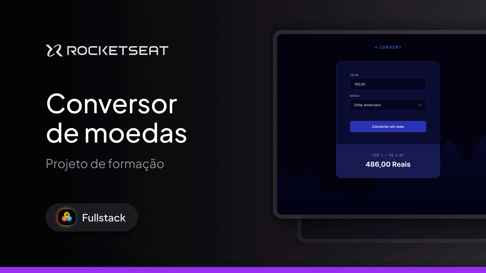

<h1 align="center">💱 Convert App — JavaScript Review</h1> 

 Currency converter rebuilt from scratch as part of my review of <strong>JavaScript fundamentals</strong> during the <strong>Rocketseat Fullstack</strong> formation. 
 

 
<a href="#-about-the-project">About</a>&nbsp;&nbsp;&nbsp;|&nbsp;&nbsp;&nbsp; 
<a href="#-technologies">Technologies</a>&nbsp;&nbsp;&nbsp;|&nbsp;&nbsp;&nbsp; 
<a href="#-learning-goals">Learning Goals</a>&nbsp;&nbsp;&nbsp;|&nbsp;&nbsp;&nbsp; 
<a href="#-layout">Layout</a>&nbsp;&nbsp;&nbsp;|&nbsp;&nbsp;&nbsp; 
<a href="#memo-license">License</a> 

 

 
 

   

 
 

## 🚀 About the Project
This project is a currency converter that allows users to:

- Input an amount

- Select a source currency

- Select a target currency

- View the converted result instantly

I rebuilt this project line by line, carefully reviewing every concept from the first module of the Fullstack formation.

The focus was on revisiting and reinforcing my understanding of JavaScript basics, especially:

- DOM manipulation

- Event handling

- Mathematical operations

- Conditional logic

- Function structure

Exchange rates are still updated manually, as the main objective here was to solidify my JavaScript logic, not API integration (yet!).

## 🛠 Technologies
This project uses:

- HTML

- CSS

- JavaScript

- DOM Manipulation

- Git & GitHub

- Figma for layout reference

- Basic Responsiveness techniques

## 🎯 Learning Goals
✅ Strengthen understanding of variables, functions, conditionals, and loops

✅ Practice DOM selection and manipulation

✅ Work with JavaScript events

✅ Improve code organization and semantic HTML

✅ Refine CSS styling and layout

✅ Simulate a real-world development process by rebuilding a project from scratch

## 🔗 Live Project
➡️ [Access the live version](https://andreskull2.github.io/convert/)  
🎓 [Watch the Rocketseat Fullstack classes](https://www.rocketseat.com.br/formacao/fullstack)

---

## 🎨 Layout
Original layout available here:

🔗 [Figma Design] (https://www.figma.com/community/file/1360315742205904074) (Figma account required)

---

## :memo: License
This project is licensed under the **MIT License.**

Feel free to study, remix, or use as a learning reference — but please give proper credit.

Rebuilt with dedication by @andreskull2 🚀
:wave: Join Rocketseat Community